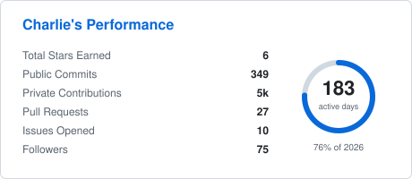
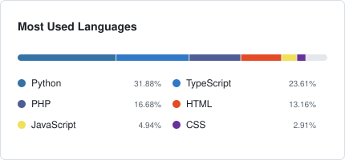

<!-- Every card below is generated by scripts/generate-cards.mjs, run daily by
     .github/workflows/profile.yml and committed into this repo. Nothing here
     depends on a third-party service staying up. -->

<picture>
  <source srcset="./assets/stats-dark.svg" media="(prefers-color-scheme: dark)" />
  
</picture>
<picture>
  <source srcset="./assets/langs-dark.svg" media="(prefers-color-scheme: dark)" />
  
</picture>

<picture>
  <source srcset="./assets/streak-dark.svg" media="(prefers-color-scheme: dark)" />
  
</picture>

<picture>
  <source srcset="./assets/activity-dark.svg" media="(prefers-color-scheme: dark)" />
  
</picture>

<picture>
  <source srcset="./assets/calendar-dark.svg" media="(prefers-color-scheme: dark)" />
  
</picture>

