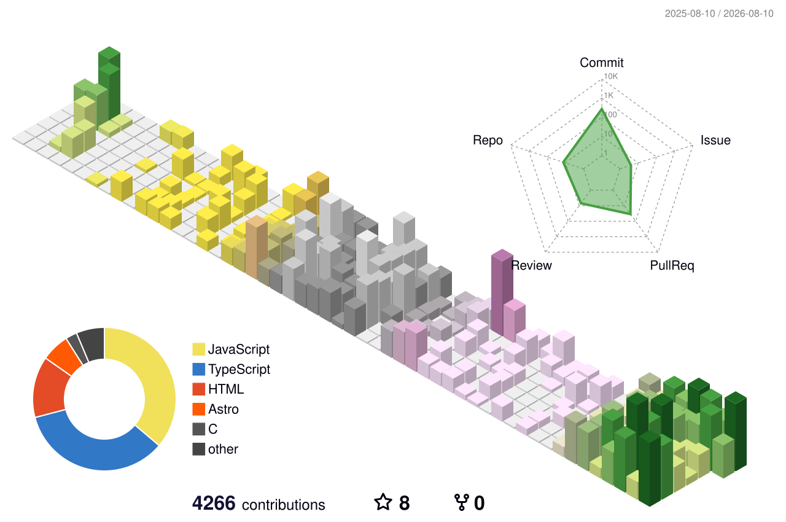

<!-- All cards below are generated by .github/workflows/profile.yml and committed
     into this repo, so nothing here depends on a third-party service staying up. -->

<!-- Stats + most used languages -->
<picture>
  <source srcset="./assets/stats-dark.svg" media="(prefers-color-scheme: dark)" />
  
</picture>
<picture>
  <source srcset="./assets/langs-dark.svg" media="(prefers-color-scheme: dark)" />
  
</picture>

<!-- Contribution streak -->
<picture>
  <source srcset="./assets/streak-dark.svg" media="(prefers-color-scheme: dark)" />
  
</picture>

<!-- Contribution activity over the last 30 days -->
<picture>
  <source srcset="./assets/activity-dark.svg" media="(prefers-color-scheme: dark)" />
  
</picture>

<!-- 3D contribution calendar -->
<picture>
  <source srcset="./profile-3d-contrib/profile-night-rainbow.svg" media="(prefers-color-scheme: dark)" />
  
</picture>

