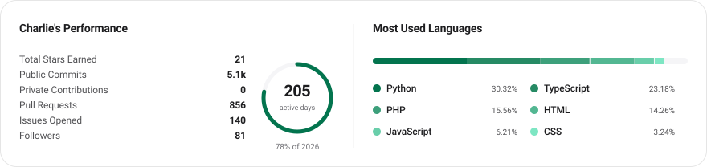
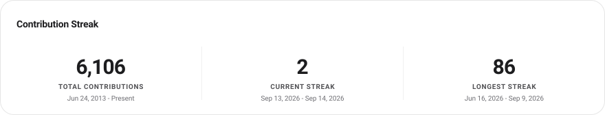
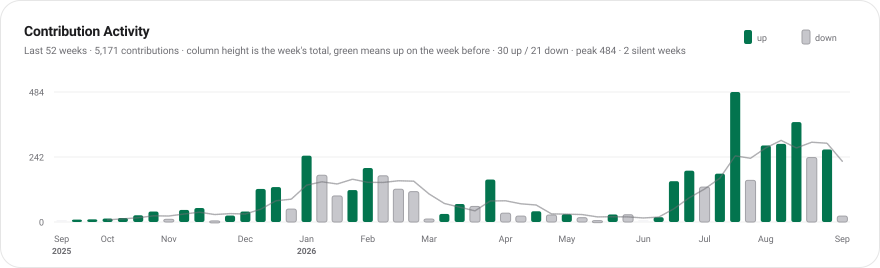
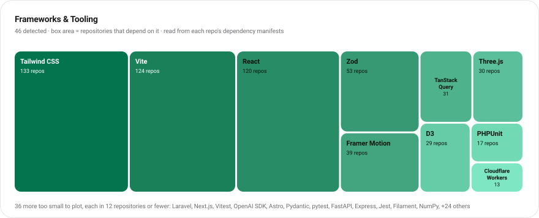
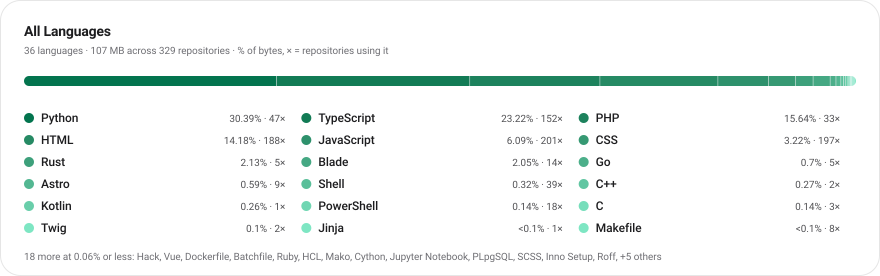
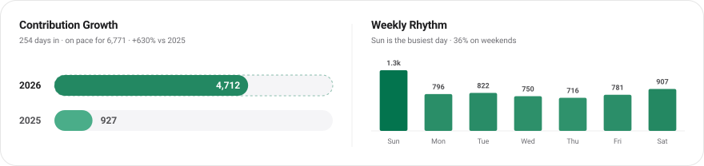
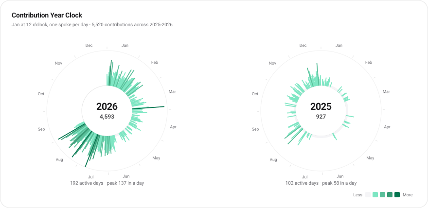

<!-- Every card below is generated by scripts/generate-cards.mjs, run daily by
     .github/workflows/profile.yml and committed into this repo. Nothing here
     depends on a third-party service staying up. All cards are 880 wide so
     their edges line up as one column.

     Order is deliberate and runs most-signal-first: identity and headline
     numbers, then "is this person active right now", then "what do they build
     with", then the slower-moving shape of the year. The tallest and most
     decorative card is last, where its height costs a reader nothing. -->

<picture>
  <source srcset="./assets/overview-dark.svg" media="(prefers-color-scheme: dark)" />
  
</picture>

<picture>
  <source srcset="./assets/streak-dark.svg" media="(prefers-color-scheme: dark)" />
  
</picture>

<picture>
  <source srcset="./assets/activity-dark.svg" media="(prefers-color-scheme: dark)" />
  
</picture>

<picture>
  <source srcset="./assets/frameworks-dark.svg" media="(prefers-color-scheme: dark)" />
  
</picture>

<picture>
  <source srcset="./assets/languages-dark.svg" media="(prefers-color-scheme: dark)" />
  
</picture>

<picture>
  <source srcset="./assets/rhythm-dark.svg" media="(prefers-color-scheme: dark)" />
  
</picture>

<picture>
  <source srcset="./assets/calendar-dark.svg" media="(prefers-color-scheme: dark)" />
  
</picture>

