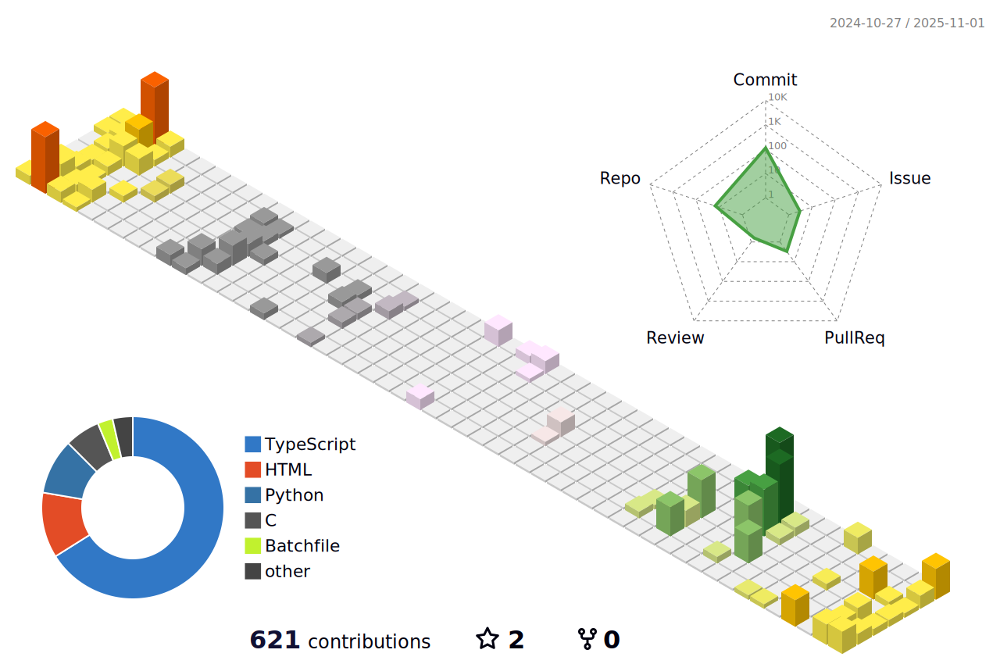

<!-- Theme-aware streak stats -->
<picture>
  <source
    srcset="https://streak-stats.demolab.com?user=tanghoong&theme=dark&hide_border=true&background=00000000"
    media="(prefers-color-scheme: dark)"
  />
  <source
    srcset="https://streak-stats.demolab.com?user=tanghoong&theme=default&hide_border=true"
    media="(prefers-color-scheme: light)"
  />
  
</picture>

<!-- Theme-aware stats cards -->
<picture>
  <source 
    srcset="https://github-readme-stats.vercel.app/api?username=tanghoong&show_icons=true&theme=dark&bg_color=00000000&hide_border=true&custom_title=Charlie%27s%20Performance"
    media="(prefers-color-scheme: dark)"
  />
  <source
    srcset="https://github-readme-stats.vercel.app/api?username=tanghoong&show_icons=true&theme=default&hide_border=true&custom_title=Charlie%27s%20Performance"
    media="(prefers-color-scheme: light)"
  />
  
</picture>

<picture>
  <source 
    srcset="https://github-readme-stats.vercel.app/api/top-langs/?username=tanghoong&layout=compact&theme=dark&bg_color=00000000&hide_border=true"
    media="(prefers-color-scheme: dark)"
  />
  <source
    srcset="https://github-readme-stats.vercel.app/api/top-langs/?username=tanghoong&layout=compact&theme=default&hide_border=true"
    media="(prefers-color-scheme: light)"
  />
  
</picture>

<!-- Theme-aware activity graph -->
<picture>
  <source
    srcset="https://github-readme-activity-graph.vercel.app/graph?username=tanghoong&theme=github-dark&hide_border=true&area=true&bg_color=00000000"
    media="(prefers-color-scheme: dark)"
  />
  <source
    srcset="https://github-readme-activity-graph.vercel.app/graph?username=tanghoong&theme=minimal&hide_border=true&area=true"
    media="(prefers-color-scheme: light)"
  />
  
</picture>

<!-- Theme-aware 3D contribution calendar -->
<picture>
  <source 
    srcset="./profile-3d-contrib/profile-night-rainbow.svg"
    media="(prefers-color-scheme: dark)"
  />
  <source
    srcset="./profile-3d-contrib/profile-season-animate.svg"
    media="(prefers-color-scheme: light)"
  />
  
</picture>

